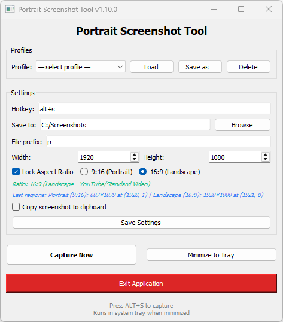

# Portrait Screenshot Tool

A lightweight, fast, and customizable **portrait-format screen capture tool** built with **PyQt5**.
Designed for creators who frequently capture **9:16 (Shorts/TikTok/Reels)** or **16:9** video frames, with a draggable overlay, global hotkey support, and auto-saving.

## Screenshot




---

## Features

- 📱 **Dual Mode Support**: Switch between Portrait (9:16) and Landscape (16:9) aspect ratios
- 🎯 **Smart Region Memory**: Remembers last capture position separately for each mode
- 🖱️ **Interactive Overlay**: Drag and resize capture area with live preview
- 🖥️ **Multi-Monitor**: Full support for multiple displays
- ⌨️ **Customizable Hotkeys**: Set your preferred keyboard shortcut
- 📋 **Auto-Clipboard**: Automatically copy screenshots to clipboard
- 🔒 **Aspect Ratio Lock**: Maintain perfect ratios while resizing
- 🌐 **System Tray**: Runs quietly in the background
- ✨ **Toast Notifications**: Visual feedback on successful captures
- 💾 **Capture Profiles**: Save and instantly reload complete settings configurations
- 📐 **Snap to Screen**: One keypress to align the capture area to a full display

## Quick Start

### Installation

```bash
# Clone the repository
git clone https://github.com/gjdragon/portrait-screenshot-tool.git
cd portrait-screenshot-tool

# Install dependencies
pip install -r requirements.txt

# Run the application
python src/main.py
```

### Requirements

```
PyQt5>=5.15.0
keyboard>=0.13.5
```

## Usage

### Basic Workflow

1. **Launch the app** - Opens in system tray
2. **Press your hotkey** (default: `Ctrl+Shift+P`) - Opens capture overlay
3. **Position the rectangle** - Drag to move, resize from edges/corners
4. **Press Enter** - Saves screenshot
5. **Press Esc** - Cancel capture

### Aspect Ratio Modes

**Portrait (9:16)** - Default: 607×1080px
- Perfect for: YouTube Shorts, TikTok, Instagram Reels
- Optimized for vertical video content

**Landscape (16:9)** - Default: 1920×1080px  
- Perfect for: YouTube videos, streaming, presentations
- Standard Full HD resolution

### Settings

Access settings from the main window or system tray:

- **Hotkey**: Customize your capture shortcut
- **Save Location**: Choose where screenshots are saved
- **File Prefix**: Add custom prefix to filenames
- **Aspect Ratio**: Lock/unlock ratio, switch between modes
- **Clipboard**: Toggle auto-copy to clipboard

## Default Hotkeys

| Action | Hotkey |
|--------|--------|
| Capture Screenshot | `Ctrl+Shift+P` (customizable) |
| Confirm Capture | `Enter` |
| Cancel Capture | `Esc` |
| Snap to Screen | `S` (while overlay is open) |

## Smart Features

### Snap to Screen
On a multi-monitor setup, aligning a full-display capture (e.g. 1920×1080) pixel-perfectly by hand is tricky — it's easy to accidentally clip a neighbouring display. Press **`S`** while the capture overlay is open to instantly snap the rectangle to exactly cover the display it's sitting on. The spinboxes in the main window update automatically to reflect the new size.

### Capture Profiles
Save your entire configuration — hotkey, save folder, file prefix, dimensions, aspect-ratio mode, and last capture regions — as a named profile. The **Profiles** panel at the top of the main window lets you:
- **Save as…** — name and store the current settings
- **Load** — restore a profile in one click; all fields update immediately
- **Delete** — remove a profile you no longer need

Profiles are great for switching between, say, a 9:16 portrait crop and a full 1080p landscape capture without touching any settings manually.

### Region Memory
The app remembers your last capture position **separately** for each mode:
- Switch to Portrait → Rectangle appears at your last portrait position
- Switch to Landscape → Rectangle appears at your last landscape position
- No need to reposition every time!

### Auto-Sizing
When you switch modes, dimensions automatically update:
- Portrait mode → 607×1080px
- Landscape mode → 1920×1080px
- Fully customizable if you need different sizes

## File Naming

### Timestamp mode (default — no prefix set)
```
Portrait_2025-02-07_143052.png
```

### Sequential mode (prefix set)
```
picture1.png, picture2.png, picture3.png, ...
```

Default save location: `~/Screenshots/`

## Configuration

Settings are stored in:
```
~/.portrait_screenshot_settings.json
```

Manual editing supported for advanced users. Profiles are stored under the `profiles` key in the same file.

## Troubleshooting

**Hotkey not working?**
- Check if another app is using the same hotkey
- Try a different combination in settings
- Run with administrator/sudo privileges if needed

**Capture area not appearing?**
- Ensure the app has screen recording permissions (macOS)
- Check if overlay is behind other windows (try Alt+Tab)

**Wrong screen captured on a multi-monitor setup?**
- Press **`S`** in the overlay to snap the rectangle to the correct display automatically

### Contributing

Contributions welcome! Please:
1. Fork the repository
2. Create a feature branch
3. Make your changes
4. Submit a pull request

## Changelog

See [CHANGELOG.md](CHANGELOG.md) for detailed version history.

## License

MIT License - See LICENSE file for details

## Support

- 🐛 **Bug Reports**: [GitHub Issues](https://github.com/gjdragon/portrait-screenshot-tool/issues)
- 💡 **Feature Requests**: [GitHub Discussions](https://github.com/gjdragon/portrait-screenshot-tool/discussions)

## Acknowledgments

Built with PyQt5 and the `keyboard` library.

---

**Made with ❤️ for content creators**